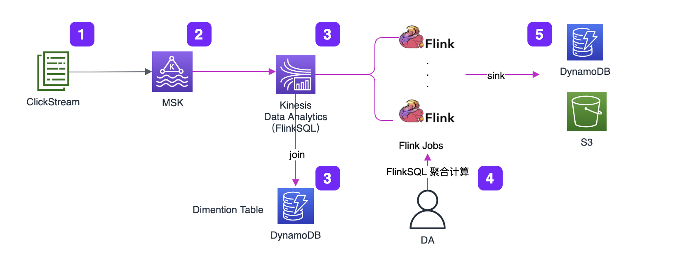
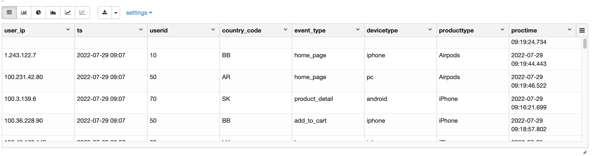
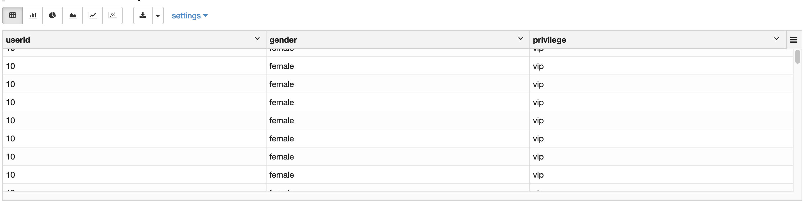
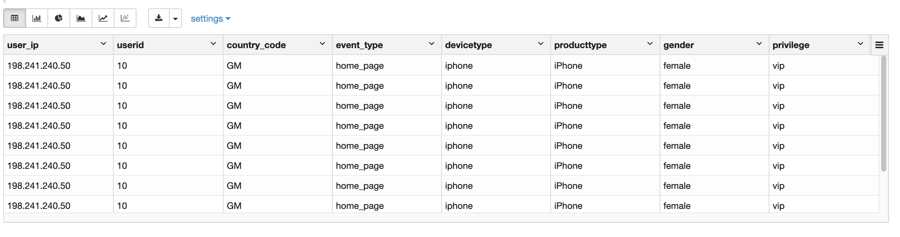

# Flink - FlinkSQL join DDB

>背景：在 Flink 实时分析场景下，DDB 作为维度表，可以通过 FlinkSQL join 方式进行基表维度扩宽


### 架构图




### Create Table 建表消费 MSK 流数据

```
%flink.ssql(type=update)
CREATE TABLE click_stream_ods (
    `user_ip` STRING NOT NULL,
    `ts` STRING NOT NULL,
    `userid` STRING NOT NULL,
    `country_code` STRING,
    `event_type` STRING,
    `userid` STRING NOT NULL,
    `devicetype` STRING NOT NULL,
    `producttype` STRING NOT NULL,
    `proctime` as PROCTIME()
)WITH (
    'connector' = 'kafka',
    'topic' = 'flinkjoinddbtopic',
    'properties.bootstrap.servers' = 'b-2.mskclustermskflinkcfm.t3her9.c14.kafka.us-west-2.amazonaws.com:9092,b-1.mskclustermskflinkcfm.t3her9.c14.kafka.us-west-2.amazonaws.com:9092,b-3.mskclustermskflinkcfm.t3her9.c14.kafka.us-west-2.amazonaws.com:9092',
    'scan.startup.mode' = 'latest-offset',
    'format' = 'json',
    'json.fail-on-missing-field' = 'false',
    'json.ignore-parse-errors' = 'true'
)
```

### 验证正常读取 MSK 流数据

```
%flink.ssql(type=update)
select * from click_stream_ods
```



### Create Table 建表读取 DDB 数据

>ddb connector - https://github.com/jerrywonggithub/flink-connector-dynamodb-1.13.2，编译jar包后上传到 Kinesis Studio 自定义 connector 配置上

```
%flink.ssql(type=update)
CREATE TABLE IF NOT EXISTS demo_dataset.dm_dynamodb_table(
    `userid` STRING,
    `gender` STRING,
    `privilege` STRING
)
WITH (
 'connector' = 'dynamodb-v2',
 'table_name' = 'dmTable',
 'primary_key' = 'userid'
)
```


### 验证正常读取 DDB 数据

```
%flink.ssql(type=update)
select * from demo_dataset.dm_dynamodb_table
```




### Join 表链接

```
%flink.ssql(type=update)
CREATE VIEW rich_user_behavior AS
SELECT C.user_ip, C.userid, C.country_code, C.event_type, C.devicetype, C.producttype, U.gender as gender, U.privilege as privilege FROM click_stream_ods AS C LEFT OUTER JOIN dm_dynamodb_table AS U ON C.userid = U.userid;
```

### 验证表连接后，数据维度扩宽

```
%flink.ssql(type=update)
select * from rich_user_behavior limit 10
```


